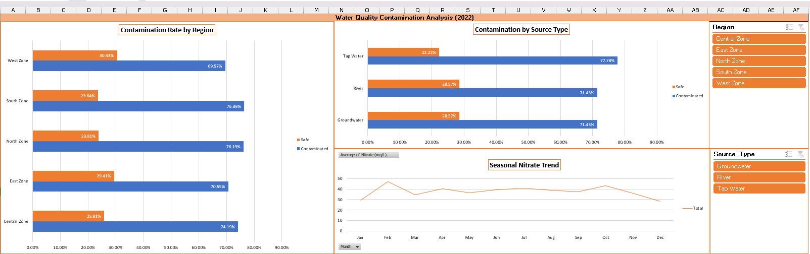
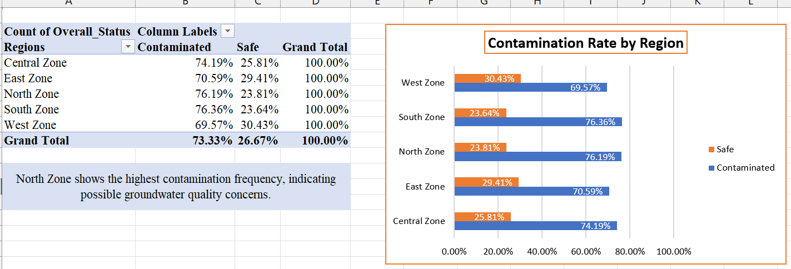
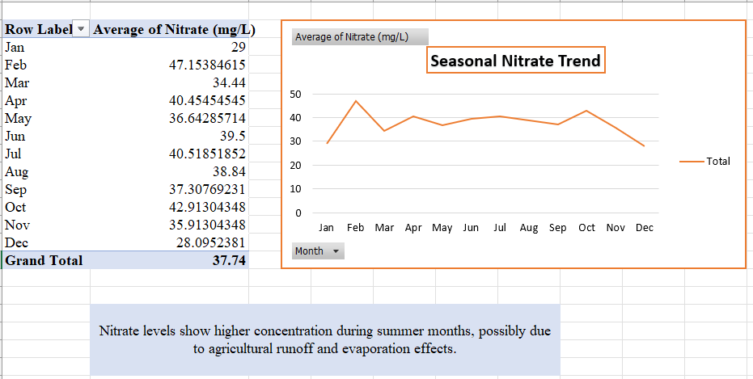
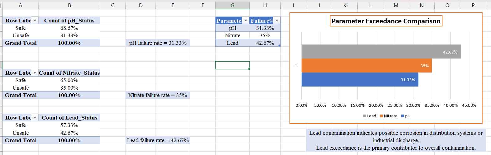

#  Water Quality Contamination Analysis (2022)

data/Water_Quality_data.xlsx

##  Project Overview

A comprehensive water quality analysis project examining contamination patterns across 300+ water samples from various regions and source types. This project demonstrates advanced Excel capabilities, including data cleaning, pivot table analysis, conditional formatting, and interactive dashboard creation.

###  Key Objectives
- Assess water quality compliance with WHO safety standards
- Identify contamination patterns across regions and source types
- Analyze seasonal trends in nitrate contamination
- Determine primary parameters contributing to water contamination

###  Key Findings
- **73.3%** of water samples failed at least one safety parameter
- **Lead contamination** is the primary concern (42.7% failure rate)
- **Tap water** shows the highest contamination risk (77.8%)
- **North Zone** has the highest contamination frequency (76.2%)
- **Nitrate levels** peak during summer months (October average: 42.9 mg/L)

##  Project Structure
water-quality-analysis-2022/
├── data/
│ ├──data/Water_Quality_data.xlsx
├── docs/ # Documentation & visuals
│ ├── dashboard_preview.png # Interactive dashboard preview
│ ├── contamination_by_region.png # Regional analysis visualization
│ ├── seasonal_nitrate_trend.png # Seasonal nitrate patterns
│ └── parameter_failure_rates.png # Parameter failure comparison
├── analysis/
│ ├── pivot_tables_summary.md # Detailed pivot table findings
│ └── key_findings.md # Comprehensive analysis report
└── methodology/
└── data_processing.md # Data cleaning methodology

## 📈 Key Visualizations

### Interactive Dashboard

### Contamination by Region

*North Zone shows the highest contamination frequency (76.2%)*

### Seasonal Nitrate Trends

*Nitrate concentrations peak during summer months*

### Parameter Failure Rates

*Lead exceedance is the primary contributor to contamination*

## 🔬 Analysis Methodology

### Data Processing
1. **Raw Data**: 300+ samples with 15 parameters including pH, EC, TDS, Hardness, Nitrate, Lead, and Temperature
2. **Data Cleaning**: Standardized formats, removed duplicates, validated ranges
3. **Status Classification**: Applied WHO safety thresholds to determine Safe/Unsafe status
   - pH: Safe range 6.5-8.5
   - Nitrate: ≤ 50 mg/L
   - Lead: ≤ 0.01 mg/L

### Analysis Performed
- **Pivot Tables**: Regional contamination rates, source-type risk assessment
- **Conditional Formatting**: Visual highlighting of unsafe parameters
- **Seasonal Analysis**: Monthly nitrate trend analysis
- **Risk Assessment**: Multi-parameter contamination evaluation

## 🛠️ Excel Features Demonstrated

| Feature | Application |
|---------|-------------|
| **Formulas** | IF, OR, TEXT functions for status classification |
| **Pivot Tables** | Regional analysis, source-type comparison, seasonal trends |
| **Charts** | Bar charts, line graphs for contamination patterns |
| **Conditional Formatting** | Visual identification of unsafe parameters |
| **Data Validation** | Ensured data integrity across 300+ entries |
| **Dashboard** | Interactive summary with slicers and dynamic charts |

## 📊 Detailed Findings

### Regional Analysis
| Region | Contamination Rate | Safe Rate |
|--------|-------------------|-----------|
| North Zone | 76.2% | 23.8% |
| South Zone | 76.4% | 23.6% |
| Central Zone | 74.2% | 25.8% |
| East Zone | 70.6% | 29.4% |
| West Zone | 69.6% | 30.4% |

### Source Type Risk Assessment
| Source | Contamination Rate | Key Concern |
|--------|-------------------|-------------|
| Tap Water | 77.8% | Lead and Nitrate exceedance |
| River | 71.4% | Seasonal contamination |
| Groundwater | 71.4% | Natural mineral content |

### Parameter Failure Analysis
| Parameter | Failure Rate | Primary Cause |
|-----------|--------------|---------------|
| Lead | 42.7% | Corrosion in distribution systems |
| Nitrate | 35.0% | Agricultural runoff |
| pH | 31.3% | Natural water chemistry |

##  Recommendations
Based on the analysis findings:
1. **Immediate Action**: Address lead contamination in tap water systems, particularly in North and South Zones
2. **Seasonal Monitoring**: Implement enhanced nitrate monitoring during summer months (June-October)
3. **Infrastructure Review**: Investigate water distribution systems for potential corrosion issues
4. **Source Protection**: Develop protection strategies for groundwater sources in high-contamination regions

##  How to Use This Project
1. **Download the Excel Workbook**: [water_quality_2022.xlsx](data/water_quality_2022.xlsx)
2. **Explore the Data**: Navigate through 8 interconnected sheets:
   - `Water_Quality_Data_Raw`: Original data with formulas
   - `Water_Quality_Data`: Cleaned dataset with month extraction
   - `Contamination%`: Overall contamination summary
   - `Contamination by Region`: Regional breakdown
   - `Risk by Source Type`: Source-type risk assessment
   - `Seasonal Nitrate Trend`: Monthly nitrate analysis
   - `Most Failures`: Parameter-wise failure analysis
   - `Dashboard`: Interactive summary dashboard
3. **Enable Editing**: To interact with pivot tables and slicers

## 🔗 Connect With Me
- **LinkedIn**: www.linkedin.com/in/huzaifa-mohsin-112598197

## 📝 License
This project is available for educational and portfolio purposes.

*Last Updated: March 2026*
